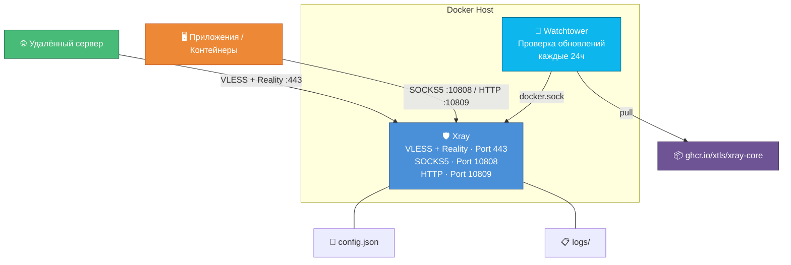

<div align="center">


# Xray Docker Auto-Update

**Обфусцированный прокси в Docker с автообновлением — SOCKS5 и HTTP на выходе**

[](https://www.docker.com/)
[](https://github.com/XTLS/Xray-core)
[](https://github.com/containrrr/watchtower)
[](https://www.linux.org/)
[](https://github.com/XTLS/Xray-core)

[](https://github.com/XTLS/Xray-core/releases)
[](LICENSE)
[](https://github.com/wojidaokz/xray-docker-autoupdate)

</div>

---

## Возможности

- **Автообновление** — Watchtower проверяет новые версии Xray каждые 24 часа и обновляет контейнер без простоя
- **VLESS + Reality** — современный протокол с маскировкой трафика, не требующий домена и сертификатов
- **Локальный прокси** — встроенные SOCKS5 (`:10808`) и HTTP (`:10809`) прокси для удобной интеграции
- **Routing-правила** — блокировка приватных сетей и BitTorrent из коробки
- **Логирование** — доступ и ошибки пишутся в файлы на хосте
- **Простой запуск** — один `docker compose up -d` и всё работает

---

## Архитектура



---

## Требования

| Компонент | Минимальная версия |
|---|---|
| **ОС** | Ubuntu 20.04+ / Debian 11+ / CentOS 8+ |
| **Docker Engine** | 20.10+ |
| **Docker Compose** | v2+ |
| **Порты** | 443, 10808, 10809 |
| **RAM** | 512 MB |
| **CPU** | 1 vCPU |

---

## Быстрый старт

### 1. Установка Docker

```bash
curl -fsSL https://get.docker.com | sh
```

Проверьте установку:

```bash
docker --version
docker compose version
```

### 2. Клонирование репозитория

```bash
git clone https://github.com/wojidaokz/xray-docker-autoupdate.git
cd xray-docker-autoupdate
```

### 3. Генерация ключей

<details>
<summary><b>UUID для клиента</b></summary>

```bash
docker run --rm ghcr.io/xtls/xray-core:latest xray uuid
```

Пример вывода:
```
a1b2c3d4-e5f6-7890-abcd-ef1234567890
```

</details>

<details>
<summary><b>Ключи Reality (x25519)</b></summary>

```bash
docker run --rm ghcr.io/xtls/xray-core:latest xray x25519
```

Пример вывода:
```
Private key: aBcDeFgHiJkLmNoPqRsTuVwXyZ0123456789abcdef0
Public key:  xYzAbCdEfGhIjKlMnOpQrStUvWxYz0123456789abc
```

> **Private key** — для сервера (`config.json`), **Public key** — для клиента

</details>

<details>
<summary><b>Short ID</b></summary>

```bash
openssl rand -hex 8
```

Пример вывода:
```
a1b2c3d4e5f6g7h8
```

</details>

### 4. Настройка конфигурации

```bash
nano config.json
```

Замените плейсхолдеры:

| Плейсхолдер | Описание | Где взять |
|---|---|---|
| `YOUR-UUID-HERE` | UUID клиента | Шаг 3 → UUID |
| `YOUR-PRIVATE-KEY-HERE` | Приватный ключ Reality | Шаг 3 → x25519 |
| `YOUR-SHORT-ID-HERE` | Идентификатор сессии | Шаг 3 → Short ID |
| `example.com` | Сайт-маскировка для Reality | Домен с TLS 1.3 и H2 |

### 5. Запуск

```bash
docker compose up -d
```

Проверка статуса:

```bash
docker compose ps
```

```
NAME        IMAGE                            STATUS
xray        ghcr.io/xtls/xray-core:latest    Up
watchtower  containrrr/watchtower            Up
```

> Готово! Сервер работает и будет автоматически обновляться.

---

## Открытые порты

| Порт | Протокол | Назначение |
|---|---|---|
| `443` | VLESS + Reality | Входящий обфусцированный трафик |
| `10808` | SOCKS5 | Локальный прокси (с поддержкой UDP) |
| `10809` | HTTP | Локальный HTTP-прокси |

> **SOCKS5 и HTTP** слушают на `0.0.0.0` — доступны из Docker-сети и с хоста. Для использования из других контейнеров указывайте `xray:10808` или `xray:10809`.

---

## Использование

Xray принимает обфусцированный VLESS+Reality трафик на порт `443` и отдаёт его через локальные прокси-порты:

```bash
# SOCKS5
curl --proxy socks5h://127.0.0.1:10808 https://ifconfig.me

# HTTP
curl --proxy http://127.0.0.1:10809 https://ifconfig.me
```

### Переменные окружения

Для направления трафика приложений через прокси:

```bash
export http_proxy=http://127.0.0.1:10809
export https_proxy=http://127.0.0.1:10809
export all_proxy=socks5h://127.0.0.1:10808
```

### Прокси для других контейнеров

Если Xray работает в Docker-сети, другие контейнеры могут обращаться к нему по имени сервиса:

```yaml
environment:
  - http_proxy=http://xray:10809
  - https_proxy=http://xray:10809
```

### Туннель (TUN-режим)

Если нужно направить **весь системный трафик** через прокси (а не только приложения с поддержкой SOCKS5/HTTP), используйте [socks2tun](https://github.com/nicksrepo/socks2tun) — он создаёт TUN-интерфейс поверх SOCKS5-прокси.

---

## Управление

### Основные команды

```bash
# Запуск контейнеров
docker compose up -d

# Остановка
docker compose down

# Перезапуск Xray (после изменения config.json)
docker compose restart xray

# Статус контейнеров
docker compose ps
```

### Просмотр логов

```bash
# Логи Xray
docker compose logs xray

# Логи Watchtower (обновления)
docker compose logs watchtower

# Логи в реальном времени
docker compose logs -f xray

# Файловые логи
cat logs/access.log
cat logs/error.log
```

### Автообновление

Watchtower автоматически проверяет `ghcr.io/xtls/xray-core:latest` каждые 24 часа.

При обнаружении новой версии:
1. Скачивает новый образ
2. Останавливает контейнер Xray
3. Запускает контейнер с новым образом
4. Удаляет старый образ

Принудительная проверка:

```bash
docker compose restart watchtower
```

<details>
<summary><b>Изменение интервала проверки</b></summary>

Отредактируйте `WATCHTOWER_POLL_INTERVAL` в `docker-compose.yml`:

| Интервал | Секунды |
|---|---|
| Каждые 6 часов | `21600` |
| Каждые 12 часов | `43200` |
| Раз в сутки | `86400` |
| Раз в неделю | `604800` |

</details>

---

## Уровни логирования

| Уровень | Описание |
|---|---|
| `none` | Логирование отключено |
| `error` | Только ошибки |
| `warning` | Предупреждения и ошибки (по умолчанию) |
| `info` | Информационные сообщения |
| `debug` | Детальная отладка |

Измените `loglevel` в `config.json` и перезапустите:

```bash
docker compose restart xray
```

---

## Структура проекта

```
xray-docker-autoupdate/
├── docker-compose.yml   # Docker Compose конфигурация
├── config.json          # Конфигурация Xray (VLESS + Reality)
├── logs/                # Логи Xray (создаётся автоматически)
│   ├── access.log       # Лог подключений
│   └── error.log        # Лог ошибок
├── .gitignore           # Исключения для Git
└── README.md            # Документация
```

---

## Безопасность

> **Важно:** Никогда не публикуйте ваш `config.json` — он содержит приватные ключи сервера.

- Используйте файрвол (UFW / iptables) — откройте только порт 443 и SSH (порты 10808/10809 не должны быть открыты наружу)
- Настройте SSH-доступ по ключу, отключите вход по паролю
- Регулярно проверяйте логи Xray на подозрительную активность
- Встроенные routing-правила блокируют доступ к приватным сетям и BitTorrent

---

## Решение проблем

<details>
<summary><b>Контейнер Xray не запускается</b></summary>

Проверьте логи:
```bash
docker compose logs xray
```

Валидация конфигурации:
```bash
docker run --rm -v $(pwd)/config.json:/etc/xray/config.json \
  ghcr.io/xtls/xray-core:latest xray -test -config /etc/xray/config.json
```

</details>

<details>
<summary><b>Порт 443 занят</b></summary>

Найдите процесс, занимающий порт:
```bash
sudo ss -tlnp | grep 443
```

Остановите его или измените порт в `config.json`.

</details>

<details>
<summary><b>Watchtower не обновляет контейнер</b></summary>

Проверьте логи:
```bash
docker compose logs watchtower
```

Убедитесь, что Docker-сокет доступен:
```bash
ls -la /var/run/docker.sock
```

</details>

<details>
<summary><b>Прокси не отвечает на локальных портах</b></summary>

Проверьте, что контейнер запущен и порты проброшены:
```bash
docker compose ps
curl --proxy socks5h://127.0.0.1:10808 https://ifconfig.me
```

Если используется Docker-сеть (не host mode), убедитесь что порты 10808 и 10809 проброшены в `docker-compose.yml`.

</details>

---

## Лицензия

Этот проект распространяется под лицензией [MIT](LICENSE).

---

<div align="center">

**[Наверх](#xray-docker-auto-update)**

</div>
