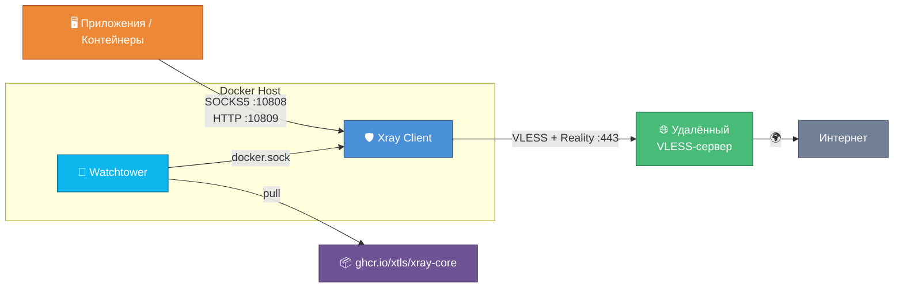

<div align="center">


# Xray Docker Auto-Update

**Обфусцированный прокси в Docker с автообновлением — SOCKS5 и HTTP на выходе**

[](https://www.docker.com/)
[](https://github.com/XTLS/Xray-core)
[](https://github.com/containrrr/watchtower)
[](https://www.linux.org/)
[](https://github.com/XTLS/Xray-core)

[](https://github.com/XTLS/Xray-core/releases)
[](LICENSE)
[](https://github.com/wojidaokz/xray-docker-autoupdate)

</div>

---

## Что это

Контейнерное решение для запуска Xray в режиме **клиентского прокси**. Xray подключается к удалённому VLESS+Reality серверу и предоставляет локальные SOCKS5 и HTTP прокси-порты для приложений и других контейнеров.

Watchtower автоматически обновляет Xray при выходе новых версий.

## Возможности

- **Автообновление** — Watchtower проверяет новые версии Xray каждые 24 часа и обновляет контейнер без простоя
- **VLESS + Reality** — обфусцированное подключение к удалённому серверу
- **Локальный прокси** — SOCKS5 (`:10808`) и HTTP (`:10809`) для приложений и контейнеров
- **Routing-правила** — приватные сети идут напрямую, BitTorrent блокируется
- **Логирование** — доступ и ошибки пишутся в файлы на хосте
- **Простой запуск** — один `docker compose up -d` и всё работает

---

## Архитектура



---

## Требования

| Компонент | Минимальная версия |
|---|---|
| **ОС** | Ubuntu 20.04+ / Debian 11+ / CentOS 8+ |
| **Docker Engine** | 20.10+ |
| **Docker Compose** | v2+ |
| **RAM** | 512 MB |
| **CPU** | 1 vCPU |

Также необходим доступ к удалённому VLESS+Reality серверу (адрес, UUID, Public Key, SNI, Short ID).

---

## Быстрый старт

### 1. Установка Docker

```bash
curl -fsSL https://get.docker.com | sh
```

Проверьте установку:

```bash
docker --version
docker compose version
```

### 2. Клонирование репозитория

```bash
git clone https://github.com/wojidaokz/xray-docker-autoupdate.git
cd xray-docker-autoupdate
```

### 3. Подготовка директории логов

Создайте директорию и установите права доступа (контейнер Xray работает от непривилегированного пользователя):

```bash
mkdir -p logs && chmod 777 logs
```

> **Важно:** Без этого шага Xray не сможет запуститься — будет ошибка `permission denied` при записи логов.

### 4. Настройка конфигурации

Откройте файл и заполните параметры подключения к вашему VLESS-серверу:

```bash
nano config.json
```

#### Откуда брать параметры

Если у вас есть VLESS-строка подключения, она содержит все необходимые данные:

```
vless://UUID@ADDRESS:PORT?security=reality&type=tcp&flow=xtls-rprx-vision&sni=SNI_DOMAIN&fp=FINGERPRINT&pbk=PUBLIC_KEY&sid=SHORT_ID#NAME
```

Соответствие параметров строки и `config.json`:

| Плейсхолдер в config.json | Параметр в VLESS-строке | Пример |
|---|---|---|
| `YOUR-SERVER-ADDRESS` | `ADDRESS` (после `@`) | `proxy.example.com` |
| `YOUR-UUID-HERE` | `UUID` (после `vless://`) | `a1b2c3d4-e5f6-7890-abcd-ef1234567890` |
| `YOUR-PUBLIC-KEY-HERE` | `pbk=` | `xYzAbCdEfGhIjKlMnOpQrStUvWx0123456789abc` |
| `YOUR-SNI-DOMAIN` | `sni=` | `www.example.com` |
| `YOUR-SHORT-ID-HERE` | `sid=` | `a1b2c3d4e5f6g7h8` |

Также в `realitySettings.fingerprint` укажите значение из параметра `fp=` строки подключения (например `chrome`, `firefox`, `qq` и др.).

### 5. Запуск

```bash
docker compose up -d
```

Проверка статуса:

```bash
docker compose ps
```

```
NAME        IMAGE                            STATUS
xray        ghcr.io/xtls/xray-core:latest    Up
watchtower  containrrr/watchtower            Up
```

### 6. Проверка работы

```bash
# Проверка через SOCKS5
curl --proxy socks5h://127.0.0.1:10808 https://ifconfig.me

# Проверка через HTTP
curl --proxy http://127.0.0.1:10809 https://ifconfig.me
```

Должен вернуться IP удалённого VLESS-сервера, а не ваш локальный.

---

## Порты

| Порт | Протокол | Назначение |
|---|---|---|
| `10808` | SOCKS5 | Локальный прокси с поддержкой UDP |
| `10809` | HTTP | Локальный HTTP-прокси |

> SOCKS5 и HTTP слушают на `0.0.0.0` — доступны из Docker-сети и с хоста.

---

## Использование

### Из командной строки

```bash
# SOCKS5
curl --proxy socks5h://127.0.0.1:10808 https://ifconfig.me

# HTTP
curl --proxy http://127.0.0.1:10809 https://ifconfig.me
```

### Переменные окружения

Для направления трафика приложений через прокси:

```bash
export http_proxy=http://127.0.0.1:10809
export https_proxy=http://127.0.0.1:10809
export all_proxy=socks5h://127.0.0.1:10808
```

### Прокси для других контейнеров

Если Xray работает в Docker-сети, другие контейнеры могут обращаться к нему по имени сервиса:

```yaml
environment:
  - http_proxy=http://xray:10809
  - https_proxy=http://xray:10809
```

### Туннель (TUN-режим)

Если нужно направить **весь системный трафик** через прокси (а не только приложения с поддержкой SOCKS5/HTTP), используйте [socks2tun](https://github.com/nicksrepo/socks2tun) — он создаёт TUN-интерфейс поверх SOCKS5-прокси.

---

## Управление

### Основные команды

```bash
# Запуск
docker compose up -d

# Остановка
docker compose down

# Перезапуск Xray (после изменения config.json)
docker compose restart xray

# Статус
docker compose ps
```

### Просмотр логов

```bash
# Логи Xray
docker compose logs xray

# Логи Watchtower (обновления)
docker compose logs watchtower

# Логи в реальном времени
docker compose logs -f xray

# Файловые логи
cat logs/access.log
cat logs/error.log
```

### Автообновление (Watchtower)

[Watchtower](https://github.com/containrrr/watchtower) автоматически проверяет `ghcr.io/xtls/xray-core:latest` каждые 24 часа.

При обнаружении новой версии:
1. Скачивает новый образ
2. Останавливает контейнер Xray
3. Запускает контейнер с новым образом
4. Удаляет старый образ

Принудительная проверка:

```bash
docker compose restart watchtower
```

<details>
<summary><b>Изменение интервала проверки</b></summary>

Отредактируйте `WATCHTOWER_POLL_INTERVAL` в `docker-compose.yml`:

| Интервал | Секунды |
|---|---|
| Каждые 6 часов | `21600` |
| Каждые 12 часов | `43200` |
| Раз в сутки | `86400` |
| Раз в неделю | `604800` |

</details>

<details>
<summary><b>Почему Watchtower v1.7.1</b></summary>

Watchtower `v1.7.1` (ноябрь 2023) — последняя версия проекта. Разработка официально прекращена, однако для задачи отслеживания и обновления одного контейнера он работает стабильно и надёжно.

В `docker-compose.yml` добавлена переменная `DOCKER_API_VERSION=1.40` — она необходима для совместимости Watchtower с Docker Engine 25+ (Docker обновил минимальную версию API, а Watchtower использует старый клиент).

**Как убедиться что Watchtower работает:**

```bash
# Статус контейнера (должен быть Up, а не Restarting)
docker compose ps watchtower

# Логи — должна быть строка "Scheduling first run"
docker compose logs watchtower
```

**Что должно быть в логах при нормальной работе:**

```
Watchtower 1.7.1
Using no notifications
Only checking containers which name matches "xray"
Scheduling first run: 2026-03-13 09:17:43 +0000 UTC
```

**Что должно быть после успешного обновления:**

```
Found new ghcr.io/xtls/xray-core:latest image
Stopping /xray ...
Creating /xray ...
Removing image ...
```

**Если Watchtower падает в цикл перезапусков** — смотрите раздел [Решение проблем](#решение-проблем).

</details>

---

## Уровни логирования

| Уровень | Описание |
|---|---|
| `none` | Логирование отключено |
| `error` | Только ошибки |
| `warning` | Предупреждения и ошибки (по умолчанию) |
| `info` | Информационные сообщения |
| `debug` | Детальная отладка |

Измените `loglevel` в `config.json` и перезапустите:

```bash
docker compose restart xray
```

---

## Структура проекта

```
xray-docker-autoupdate/
├── docker-compose.yml   # Docker Compose конфигурация
├── config.json          # Конфигурация Xray (подключение + локальные прокси)
├── logs/                # Логи Xray (создать вручную, chmod 777)
│   ├── access.log       # Лог подключений
│   └── error.log        # Лог ошибок
├── .gitignore           # Исключения для Git
└── README.md            # Документация
```

---

## Безопасность

> **Важно:** Никогда не публикуйте ваш `config.json` — он содержит ключи подключения к серверу.

- Порты 10808/10809 не должны быть открыты наружу — используйте файрвол
- Настройте SSH-доступ по ключу, отключите вход по паролю
- Регулярно проверяйте логи Xray на подозрительную активность
- Routing-правила направляют трафик к приватным сетям напрямую (минуя прокси), BitTorrent блокируется

---

## Решение проблем

<details>
<summary><b>Xray падает с ошибкой permission denied</b></summary>

Контейнер Xray работает от непривилегированного пользователя и не может создать файлы логов. Убедитесь что директория `logs/` существует и доступна для записи:

```bash
mkdir -p logs && chmod 777 logs
docker compose restart xray
```

</details>

<details>
<summary><b>Xray не читает config.json</b></summary>

Официальный образ `ghcr.io/xtls/xray-core` ожидает конфиг по пути `/usr/local/etc/xray/config.json`. В `docker-compose.yml` уже прописан правильный маунт:

```yaml
volumes:
  - ./config.json:/usr/local/etc/xray/config.json
```

Если вы меняли `docker-compose.yml`, убедитесь что путь монтирования именно `/usr/local/etc/xray/config.json`, а **не** `/etc/xray/config.json`.

</details>

<details>
<summary><b>Контейнер Xray не запускается</b></summary>

Проверьте логи:
```bash
docker compose logs xray
```

Валидация конфигурации:
```bash
docker run --rm -v $(pwd)/config.json:/usr/local/etc/xray/config.json \
  ghcr.io/xtls/xray-core:latest xray -test -config /usr/local/etc/xray/config.json
```

</details>

<details>
<summary><b>Прокси не отвечает на локальных портах</b></summary>

Проверьте что контейнер запущен:
```bash
docker compose ps
```

Проверьте подключение:
```bash
curl --proxy socks5h://127.0.0.1:10808 --max-time 10 https://ifconfig.me
```

При использовании `network_mode: host` (по умолчанию) порты доступны напрямую. Если вы переключились на Docker-сеть — добавьте проброс портов в `docker-compose.yml`:

```yaml
ports:
  - "10808:10808"
  - "10809:10809"
```

</details>

<details>
<summary><b>Watchtower постоянно перезапускается (Restarting)</b></summary>

Проверьте логи:
```bash
docker compose logs watchtower
```

Если видите ошибку `client version 1.25 is too old. Minimum supported API version is 1.40`:

Это несовместимость версии Docker API. В `docker-compose.yml` уже добавлена переменная `DOCKER_API_VERSION=1.40` для решения этой проблемы. Если вы обновили Docker до новейшей версии и ошибка вернулась — проверьте текущую версию API:

```bash
docker version --format '{{.Server.APIVersion}}'
```

И при необходимости обновите значение `DOCKER_API_VERSION` в `docker-compose.yml`.

</details>

<details>
<summary><b>Watchtower не обновляет контейнер</b></summary>

Проверьте логи:
```bash
docker compose logs watchtower
```

Убедитесь что Docker-сокет доступен:
```bash
ls -la /var/run/docker.sock
```

</details>

---

## Лицензия

Этот проект распространяется под лицензией [MIT](LICENSE).

---

<div align="center">

**[Наверх](#xray-docker-auto-update)**

</div>
